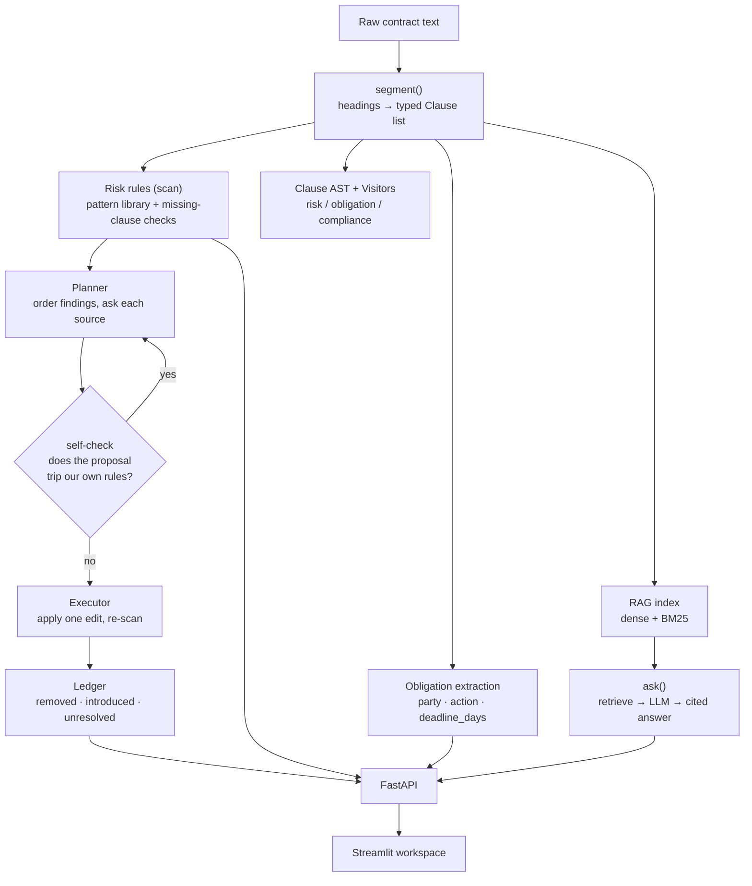
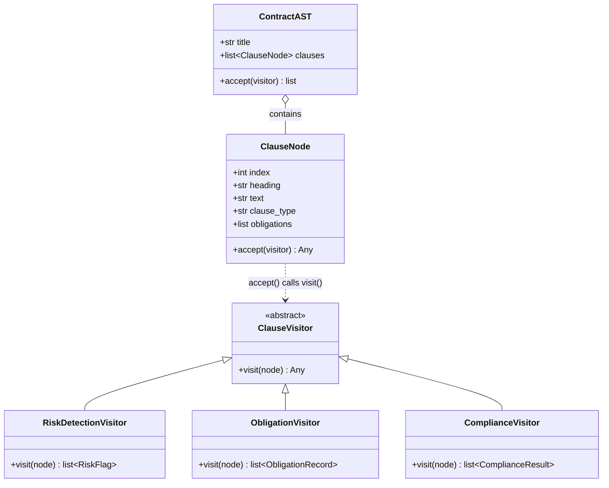

<div align="center">


</div>

# ContractGuard — Legal Contract Intelligence & Clause AST Analysis

**Read a contract the way a reviewer does — clause by clause, then propose the words that go in its place.** ContractGuard segments a pasted agreement into typed clauses, flags risky language with a severity and a plain-English reason, extracts who-owes-what-by-when obligations, drafts a **redline plan** whose every proposal is re-scanned by the same rule library before it is offered, and answers questions across a clause library with citations.

<div align="center">

[](https://www.python.org/)
[](https://fastapi.tiangolo.com/)
[](https://pytest.org/)
[](https://opensource.org/licenses/MIT)

</div>

---

## The problem

Contract review is repetitive pattern-spotting. A reviewer skims for the same handful of traps — uncapped liability, one-sided termination, an auto-renewal with a five-day opt-out window, a blanket IP assignment — then checks that the boilerplate everyone forgets (a liability cap, a confidentiality clause) is actually present. Doing this by hand across a stack of agreements is slow and easy to get wrong.

ContractGuard automates the first pass: it turns raw contract text into structured clauses, runs a library of risk rules and compliance checks over them, pulls out dated obligations, and lets you ask natural-language questions over a whole corpus of contracts with clause-level citations.

Flagging is only half the job, though. The reviewer's next move is to propose replacement wording — and that proposal has to survive the same scrutiny as the clause it replaces. A "safe" liability clause lifted from another agreement you signed is worthless if it happens to be the *uncapped* one. So the redline pass never ships its first candidate: it re-scans every proposal through the pattern library, and re-scans the whole document after each edit so an edit that resolves one finding while creating another is reported as a regression instead of disappearing into a net count.

## What it does

- **Segments** a contract into clauses on numbered/ALL-CAPS headings and classifies each by keyword profile (payment, termination, indemnification, IP, ...).
- **Flags risk** with a regex pattern library — each finding carries a severity (`high`/`medium`/`low`), the triggering excerpt, and a reviewer-actionable explanation. Also flags *missing* expected clauses.
- **Extracts obligations** of the form "*&lt;party&gt; shall &lt;action&gt; within N days*" into structured records with deadlines.
- **Redlines**, per finding: proposes replacement language — first from precedent (a clause of the same type already in force elsewhere in the corpus, cited `[contract-N clause-M]`), then from a drafted playbook position — applies the edits one at a time, and reports what each one removed, introduced, and left standing.
- **Answers questions** over a clause corpus using hybrid retrieval + a swappable LLM, returning `[contract-N clause-M]` citations.

## How it works

A contract flows through one segmentation step, then fans out into independent analysis passes and an optional RAG index. Nothing downstream re-parses the text.



The HTTP `/review` endpoint serves the `segment → scan` pipeline; `/redline` serves the planner/executor/ledger path; `/ask` serves the RAG path. The **clause AST and its Visitors** are an independent, importable analysis layer (see below) demonstrated and tested in isolation.

## The Visitor pattern: extensible clause analysis

Evaluating a contract means running several *unrelated* analyses over the same structure — risk detection, obligation extraction, regulatory compliance. Baking every rule into the parser produces tightly coupled code where changing a legal rule risks breaking tokenisation. ContractGuard instead parses clauses into a typed AST (`ContractAST` → `ClauseNode`) and expresses each analysis as a `ClauseVisitor`. Adding a new pass means writing one class; the AST nodes never change (open–closed).



`ContractAST.accept(visitor)` walks each `ClauseNode`, which double-dispatches back into `visitor.visit(node)`, and collects the non-empty results.

| Visitor | Looks for | Emits |
|---|---|---|
| `RiskDetectionVisitor` | High-risk phrasing (uncapped liability, unilateral termination, auto-renewal traps, broad IP assignment, penalties, non-competes) | `RiskFlag(clause_index, risk_category, matched_phrase, severity)` |
| `ObligationVisitor` | Pre-extracted clause obligations | `ObligationRecord(party, action, deadline_days)` |
| `ComplianceVisitor` | GDPR / CCPA / SOX / breach-notification indicators | `ComplianceResult(requirement, satisfied, evidence)` |

Adding, say, an ESG-warranty extractor requires no change to the parser or the other visitors:

```python
from contractguard.ast import ClauseNode, ClauseVisitor, build_ast

class ESGVisitor(ClauseVisitor):
    def visit(self, node: ClauseNode):
        t = node.text.lower()
        if "carbon offset" in t or "net zero" in t:
            return f"Clause {node.index}: ESG commitment identified"
        return None  # None results are skipped

ast = build_ast("Master Services Agreement", clauses)
findings = ast.accept(ESGVisitor())
```

## Methodology

**Segmentation.** Clauses are split on a heading regex (`^\d+\.`, `ARTICLE`, or a long ALL-CAPS line). Each clause is typed by counting keyword hits per category and taking the argmax, with a hit in the *heading* worth three body hits — body-only scoring ties constantly and the ties used to be broken by declaration order, so a clause headed CONFIDENTIALITY that said "survives three years after termination" came back as `termination`. Obligations are pulled with a `(party) shall (action) [within N days]` pattern.

**Risk rules.** `risk/rules.py` holds a small library of `(rule_id, severity, regex, explanation)` tuples compiled with `IGNORECASE | DOTALL` so patterns span line breaks. After pattern matching, the scanner cross-checks a configurable list of required clause types (`flag_missing_clauses` in `configs/config.yaml`) and raises a `missing_*` finding for any that are absent. Findings are sorted high → low severity.

**Hybrid-retrieval RAG.** The clause corpus is indexed two ways — dense embeddings (`fastembed`, MiniLM-L6-v2, cosine) and lexical BM25 (`rank_bm25`) — and the two rankings are combined with Reciprocal Rank Fusion:

$$\text{RRF}(d) = \sum_{r \in \{\text{dense},\,\text{bm25}\}} \frac{1}{k + \text{rank}_r(d)}, \qquad k = 60$$

The top-`k` fused clauses become the LLM context, and the answer cites each source as `[contract-N clause-M]`.

**Redlining.** `scan()` produces findings; `orchestrator/planner.py` turns them into an ordered edit plan (high severity first, since that is the order a reviewer spends goodwill in), asking each `RedlineSource` in turn — precedent from the clause library first, the drafted playbook position as a fallback. A source never returns its first candidate blindly: `RedlineSource.propose` runs the candidate back through `scan_patterns()` and keeps the first one that comes back clean, recording every rejection with the rule that killed it.

`orchestrator/executor.py` then applies the edits **one at a time**, re-scanning the whole document between each. That is what lets `orchestrator/memory.py` diff the finding multisets around a single edit and attribute an introduced finding to the edit that caused it — an edit that swaps `missing_limitation_of_liability` for `unlimited_liability` has an unchanged finding *count* and is reported as a regression anyway. Findings the playbook deliberately does not answer (`no_liability_carveout`, `payment_late_penalty` — both surgical edits to terms the counterparty already negotiated) stay in the output under `needs_review` with the reason, rather than silently vanishing.

**Swappable LLM.** `llm/base.py` defines a two-method `LLMProvider` protocol (`complete`, `stream`). `get_provider()` selects `ollama` (default), `claude`, or `fake` from the `LLM_PROVIDER` env var — no calling code changes. `FakeProvider` is deterministic for offline tests.

## Getting started

```bash
make install        # uv sync --group dev
make test           # uv run pytest --cov

python scripts/make_contracts.py   # generate the synthetic corpus (needed for /corpus and /ask)

make api            # FastAPI on http://localhost:8160
make ui             # Streamlit workspace on http://localhost:8661
```

`make ui` points the app at the API via `CONTRACTGUARD_API_URL=http://localhost:8160`. The `/ask` and `/corpus` endpoints need the generated corpus; `/review` works on any pasted text without it. Configure the LLM with `LLM_PROVIDER` (and `ANTHROPIC_API_KEY` for Claude, or a running Ollama for `ollama`).

Or with Docker:

```bash
make docker-up      # docker compose up --build -d
make docker-down
```

## API

| Method | Route | Purpose |
|---|---|---|
| `GET`  | `/health` | Liveness check |
| `POST` | `/review` | Segment pasted contract text and return clauses, obligations, and risk findings |
| `GET`  | `/corpus` | Per-contract summary over the synthetic corpus (planted risks vs. findings) |
| `POST` | `/redline` | Propose and apply replacement language for every finding; returns the ordered plan, the per-edit ledger, and the redlined text (`apply: false` plans without editing) |
| `POST` | `/ask`    | Ask a question over the clause corpus; returns a cited answer (`provider` selectable) |

```bash
curl -X POST localhost:8160/review -H 'content-type: application/json' \
  -d '{"text": "SERVICES AGREEMENT\n\n9. LIABILITY\nVendor'\''s liability shall not be capped or limited in any respect."}'

curl -X POST localhost:8160/redline -H 'content-type: application/json' \
  -d '{"text": "SERVICES AGREEMENT\n\n9. LIABILITY\nVendor'\''s liability shall not be capped or limited in any respect."}' | jq '.steps[0].redline.citation, .ledger.summary'
```

## Evaluation

The corpus generator (`scripts/make_contracts.py`) builds synthetic Services Agreements and records, per contract, the exact set of risky clauses it planted (`planted_risks`). This gives a **known ground truth**: the `/corpus` endpoint reports planted risks against the number of findings the scanner actually raises, so you can inspect where the rule library agrees with or misses the plant. The test suite additionally asserts that a fixture contract's planted risks (`unlimited_liability`, `unilateral_termination`, `auto_renewal_trap`) are all detected.

To reproduce, regenerate the corpus and compare:

```bash
python scripts/make_contracts.py
make api
curl localhost:8160/corpus        # planted_risks vs. n_findings per contract
```

### What the self-check is worth

`scripts/redline_bench.py` runs the redline pass over the whole corpus twice — once normally, once with the proposal self-check disabled — and prints the difference:

```bash
uv run python scripts/make_contracts.py     # or: make bench
uv run python scripts/redline_bench.py
```

On the default corpus (40 contracts, seed 42) that reports:

- **98 findings across 40 contracts, 98 edits applied, 0 findings left.** 63 of the edits came from the drafted playbook, 35 from precedent already in force elsewhere in the corpus.
- **The clause library has clean precedent for only 2 of the 6 risk categories.** For `broad_indemnity`, `ip_assignment`, `auto_renewal_trap` and `non_compete_broad`, exactly one wording of that clause type exists anywhere in the corpus and it is the flagged one — you cannot redline your way out of a library that never contained a good version of the clause. Those four fall through to the playbook.
- **The self-check refused 6 candidates, every one of them tripping `unlimited_liability`.** All six were answers to `missing_limitation_of_liability`: ranking precedent shortest-first puts the terse *uncapped*-liability clause ahead of the capped one, so the naive pass proposes an uncapped liability clause to fix a missing liability cap.
- **Re-run with the check off, those 6 edits go through**: the corpus ends at 6 findings instead of 0, and each one is recorded by the ledger as a regression — the target finding was genuinely resolved (a `limitation_of_liability`-typed clause now exists) while a high-severity one was created in the same edit. The finding *count* does not move, which is why the ledger diffs multisets instead of counting.

No aggregate accuracy numbers beyond these are quoted — they depend entirely on the generated dataset and seed (`configs/config.yaml`). Everything above the pattern library is rules and retrieval, so results are deterministic for a given corpus.

## Testing

```bash
make test           # uv run pytest --cov
```

- `test_review.py` — segmentation, obligation/deadline extraction, planted-risk detection, and the FastAPI `/review` contract.
- `test_redline.py` — the redline pass: that every playbook position survives its own scanner, that a replacement keeps the clause type it replaces, that risky precedent is refused and the clean one used (and that disabling the check lets it through), severity ordering, unanswerable findings surviving into `needs_review`, the pass being a fixed point on its own output, and the ledger attributing an introduced finding to the edit that caused it.
- `test_ast_visitors.py` — the AST Visitor layer: node dispatch, each concrete visitor, and `build_ast`.

## Limitations

- Detection is **pattern-based**, not semantic — reworded risky clauses that dodge the regex/keyword library are missed, and unusual phrasings can produce false positives.
- Segmentation assumes conventional numbered/ALL-CAPS headings; free-form or scanned contracts segment poorly (the fallback treats the whole document as one clause).
- Obligation extraction only recognises a fixed set of party names and the "shall ... within N days" shape.
- **The redline pass is only as safe as the pattern library.** The self-check catches a proposal that trips a *known* rule; a proposal that is bad in a way no rule describes sails through, and the pass will report the finding resolved. It is a guard against pasting in a clause the tool would itself flag, not a substitute for reading the replacement.
- Playbook positions are generic drafting, not counsel-approved language, and the pass rewrites whole clauses — it will not do the surgical edits (adding a carve-out to a negotiated cap, adjusting an interest rate), which is why those two rules are reported under `needs_review` instead.
- Precedent ranking is a heuristic (shortest clause of the right type first). The benchmark above shows it ranking the risky liability clause ahead of the safe one; the self-check is what saves it.
- The AST `RiskDetectionVisitor` and the regex library in `risk/rules.py` overlap. On the bundled corpus (`scripts/redline_bench.py`, first block) the visitor's substring phrases flag nothing the regex library misses, while the regex library flags 58 clauses the visitor does not — the Visitor layer earns its keep as an extension point, not as a second detector.
- The bundled corpus is **synthetic**; thresholds, keyword lists, and required-clause sets would need tuning on real agreements.
- RAG answer quality depends on the selected LLM provider; the default `ollama` requires a local model.

## Project structure

```
src/contractguard/
├── clauses/     # segment(): headings → typed clauses + obligation extraction
├── risk/        # regex risk-rule library + missing-clause checks (scan)
├── agents/      # Redline + RedlineSource (self-checking), playbook & precedent sources
├── orchestrator/# planner (ordered edit plan) · executor (apply + re-scan) · memory (ledger)
├── ast/         # ContractAST + ClauseVisitor pattern (risk/obligation/compliance)
├── rag/         # hybrid (dense + BM25, RRF) retrieval and cited Q&A
├── llm/         # LLMProvider protocol + claude / ollama / fake providers
├── api/         # FastAPI app (main:app) and routes
├── ui/          # Streamlit review workspace
└── settings.py  # env + configs/config.yaml loading
scripts/
├── make_contracts.py   # synthetic corpus with recorded planted risks
└── redline_bench.py    # redline pass over the corpus, with/without the self-check
```

## License

MIT

---

<div align="center">

**Jackson Marcus** · Senior AI & Machine Learning Engineer

[](https://github.com/jackson-marcus)
[](mailto:wajahatanees41@gmail.com)

</div>
