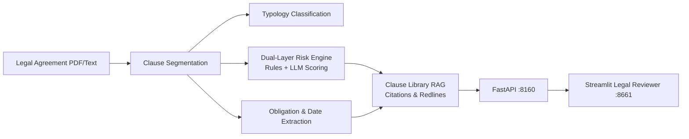

# ContractGuard — Legal Contract Intelligence & Risk Review Platform

<div align="center">

[](https://www.python.org/)
[](https://fastapi.tiangolo.com/)
[](https://streamlit.io/)
[](https://mlflow.org/)
[](https://www.docker.com/)
[](https://github.com/astral-sh/ruff)
[](https://pytest.org/)
[](https://opensource.org/licenses/MIT)

</div>

> **Automated legal contract review platform providing clause segmentation, typological classification, high-risk pattern auditing, obligation & deadline extraction, and citation-grounded clause library RAG.**

---

## 📖 Executive Summary & Value Proposition

**`contractguard`** is a production-grade, end-to-end machine learning system built with strict engineering discipline, reproducible pipelines, and enterprise MLOps best practices. It bridges the gap between theoretical statistical rigor and high-availability operational microservices.

## ⚖️ Core Methodologies & System Architecture

### 1. Hierarchical Clause Segmentation & Typology Classification
- Deterministic and neural boundary segmentation decomposing dense legal PDF/DOCX documents into structured clauses.
- Multi-class classifier mapping text to standard legal typologies (Indemnification, Limitation of Liability, Termination, Governing Law, IP Assignment, Confidentiality).

### 2. Dual-Layer Risk & Compliance Engine
- **Deterministic Rules:** Regex and syntactic pattern matching for immediate non-compliant flags (e.g. unlimited liability, uncapped indemnity, missing mutual termination).
- **Semantic Risk Scoring:** LLM-assisted contextual risk evaluation rating clauses from Low to Critical with redline suggestions.

### 3. Obligation & Temporal Deadline Extraction
- Named Entity Recognition (NER) isolating parties, actionable covenants, payment triggers, and renewal notice deadlines.

### 4. Grounded Clause Library RAG
- Hybrid dense-lexical search across corporate standard clause fallbacks.
- Conversational legal assistant with exact line-level provenance and verbatim citations.

## 📊 Architecture & Pipeline



## 🛠️ Tech Stack & Engineering Standards
- **NLP & AI:** Python 3.12, SpaCy, Sentence-Transformers, BM25, Anthropic Claude / Local Ollama
- **Serving & UI:** FastAPI, Streamlit, MLflow
- **Testing:** Pytest verification of segmentation, extraction, and risk rules


---

## 🚀 Quickstart & Setup Guide

### 1. Prerequisites & Environment Setup
Using **[uv](https://docs.astral.sh/uv/)** for lightning-fast, reproducible dependency resolution:

```bash
# Clone the repository
git clone https://github.com/jackson-marcus/contractguard.git
cd contractguard

# Install dependencies and pre-commit hooks
uv sync --group dev
```

### 2. Run Test Suite & Code Quality Checks
```bash
# Run unit & integration tests with coverage
uv run pytest --cov

# Run ruff linter and formatting checks
uv run ruff check .
uv run ruff format --check .
```

### 3. Launch Services Locally
```bash
# Start FastAPI REST API (listening on port :8160)
make api
# Or: uv run uvicorn contractguard.api.main:app --reload --port 8160

# Start interactive Streamlit dashboard (listening on port :8661)
make ui

# Launch local MLflow Experiment Tracking UI (listening on port :5017)
make mlflow
```

### 4. Run with Docker Compose
```bash
# Spin up the complete microservice stack
docker compose up --build
```

---

## 📂 Repository Layout

```
contractguard/
├── .github/workflows/ci.yml       # GitHub Actions CI pipeline (lint, test, build)
├── configs/                      # Configuration files and hyperparameters
├── data/                         # Data directory (raw, interim, processed)
├── scripts/                      # Data generators and operational scripts
├── src/contractguard/               # Core Python package
│   ├── api/                      # FastAPI routes, schemas, and endpoints
│   ├── models/                   # Statistical models, ML algorithms, and estimators
│   ├── ui/                       # Streamlit interactive application
│   └── settings.py               # Centralized configuration & environment loader
├── tests/                        # Comprehensive Pytest suite
├── docker-compose.yml            # Multi-service container orchestration
├── Dockerfile                    # Container definition for API service
├── Makefile                      # Standardized project tasks
└── pyproject.toml                # Pinned dependencies and tool configs
```

---

## 👤 Author & Contact

**Jackson Marcus**
- **Email:** [jackson.marcus.work@gmail.com](mailto:jackson.marcus.work@gmail.com)
- **Upwork:** [Jackson Marcus on Upwork](https://www.upwork.com/freelancers/~012235717501ad9c7b)
- **GitHub:** [@jackson-marcus](https://github.com/jackson-marcus)

*Available for machine learning engineering, MLOps, data science, and AI system architecture consulting and contract engagements.*

